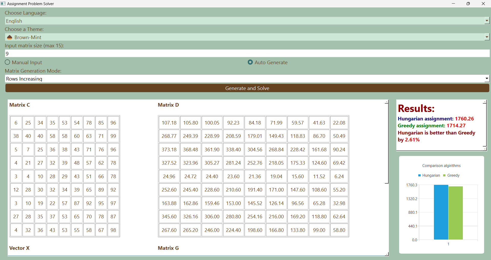
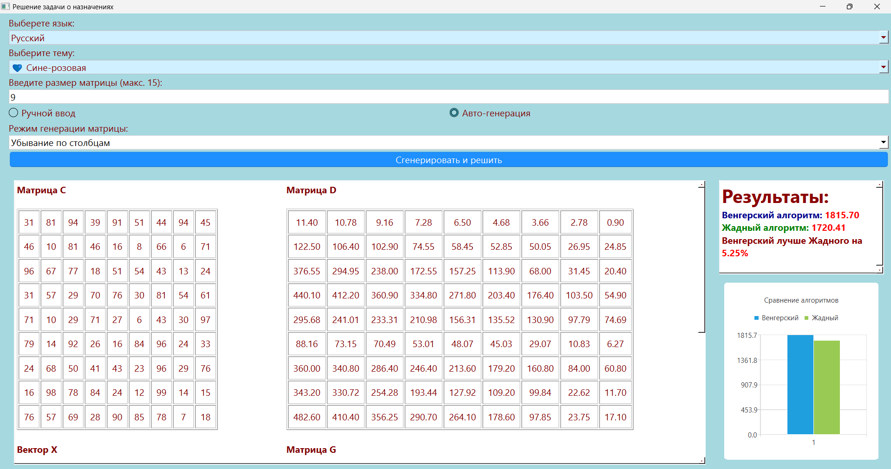

# 📊 Решение задачи о назначениях

Интерактивное настольное приложение для визуального сравнения **венгерского алгоритма** и **жадного алгоритма** при решении классической задачи о назначениях. Построено на Python с использованием PyQt6.  

## 📚 Об алгоритмах

✔️**Венгерский алгоритм** — точный метод решения задачи о назначениях  
✔️**Жадный алгоритм** — быстрая эвристика, подходит для приблизительных оценок 

---

## ✨ Возможности

✔️ Генерация или ручной ввод матрицы стоимостей (C) и вектора X  
✔️ 5 различных режимов генерации: случайные значение, отсортированные по возрастанию/убыванию строки/столбцы  
✔️ Визуальное сравнение результатов алгоритмов в виде столбчатых диаграмм  
✔️ Поддержка двух языков: English / Русский  
✔️ 4 цветовые темы интерфейса  

---

## 📦 Запуск

### 1. Клонировать репозиторий

```bash
git clone https://github.com/KseniyaBeskhmelnova/AssignmentProblemSolver.git  
cd data_collection_system  
```

### 2. Создать исполняемый файл

```bash
pip install pyinstaller  
pyinstaller --onefile --windowed --name AssignmentProblemSolver main.py
```

### 2. Запустить приложение

```bash
cd dist
./AssignmentProblemSolver.exe
```

---

## 📷 Скриншоты 

  

  


